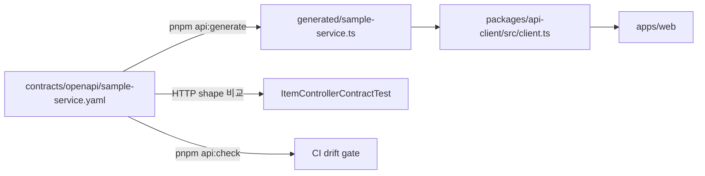

# OpenAPI 계약과 TypeScript client를 안전하게 바꾸기

이 저장소는 `contracts/openapi/sample-service.yaml`을 Gateway에 노출되는 sample API의 기준 계약으로 사용한다. React 코드에서 손으로 만든 중복 타입 대신 이 명세에서 생성한 타입을 `packages/api-client`가 사용한다.

## 1. 파일의 역할



| 파일 | 직접 수정 여부 | 역할 |
|---|---|---|
| `contracts/openapi/sample-service.yaml` | 수정함 | endpoint, 요청, 응답, status와 인증 방식의 기준 |
| `packages/api-client/src/generated/sample-service.ts` | 직접 수정하지 않음 | `openapi-typescript`가 만든 compile-time 타입 |
| `packages/api-client/src/client.ts` | 수정함 | fetch, request ID, Bearer token과 Problem Detail 해석 |
| `ItemControllerContractTest.java` | 수정함 | 실제 controller의 200/201/400과 JSON 필드 확인 |

생성 타입에는 실행 코드가 없어서 브라우저 runtime bundle에 client generator가 포함되지 않는다.

## 2. API 변경의 정확한 순서

예를 들어 Item 응답에 `description`을 추가한다고 가정한다.

### 2-1. 기준 명세 수정

`contracts/openapi/sample-service.yaml`의 `Item` schema에 필드를 추가한다. 필수 필드라면 `required`에도 넣는다.

### 2-2. 백엔드 구현과 계약 테스트 수정

`ItemResponse`, controller/service와 `ItemControllerContractTest`가 새 필드를 실제 JSON으로 반환하도록 바꾼다. 명세만 바꾸고 구현을 미루지 않는다.

### 2-3. TypeScript 타입 재생성

```powershell
cd D:\MyProjectTemplate
pnpm api:generate
```

정상 로그 예:

```text
contracts/openapi/sample-service.yaml → src/generated/sample-service.ts
```

### 2-4. API client와 화면 수정

`packages/api-client/src/client.ts`의 `Item`은 다음처럼 생성 타입을 참조한다.

```typescript
export type Item = components["schemas"]["Item"];
```

필수 필드를 빠뜨리면 TypeScript 검사가 실패한다. 화면에서 새 필드를 보여줄 필요가 있다면 `apps/web` 컴포넌트와 테스트를 함께 바꾼다.

### 2-5. 전체 검증

```powershell
$env:JAVA_HOME='C:\Program Files\Java\jdk-21'
$env:PATH="$env:JAVA_HOME\bin;$env:PATH"
./gradlew :services:sample-service:test
pnpm frontend:check
```

## 3. 생성물 drift 검사가 잡는 것

`pnpm api:check`는 생성 파일을 쓰지 않고 현재 명세로 다시 계산해 차이가 있는지 검사한다.

```powershell
pnpm api:check
```

다음 실수를 CI에서 막는다.

- OpenAPI 명세를 바꾸고 generated type을 갱신하지 않음
- generated 파일만 손으로 고쳐 명세와 달라짐
- generator version이나 option이 바뀌어 출력이 달라짐

`pnpm frontend:check`의 첫 단계가 `pnpm api:check`이므로 GitHub Actions frontend job에서도 같은 검사가 실행된다.

## 4. 현재 계약

| Method | Path | 성공 | 주요 실패 | 설명 |
|---|---|---|---|---|
| GET | `/api/v1/items` | 200 `Item[]` | 401, 500 | read-only service 경로로 목록 조회 |
| POST | `/api/v1/items` | 201 `Item` | 400, 401, 500 | 1~120자 name을 writer에 저장 |

dev/prod 계약은 OIDC Bearer JWT를 기술한다. local에서는 Gateway와 SPA의 보안 스위치를 함께 끌 수 있다. Gateway가 만든 401이나 upstream 500은 본문이 없을 수 있으므로 API client는 JSON Problem Detail이 없어도 status와 response request ID를 보존한다.

## 5. 검증 범위와 한계

- 생성 타입은 compile-time 계약이며 runtime JSON validator가 아니다.
- controller 계약 테스트는 sample controller의 status와 필드를 확인하지만 모든 ingress·Gateway 변환을 대신하지 않는다.
- 인증 callback, 실제 JWT 서명과 issuer 검증은 OIDC 통합 smoke가 별도로 필요하다.
- API 문서가 성능, 처리량 또는 가용성을 보장하지 않는다. 그런 수치는 환경·SLO·결과 파일이 있는 부하 시험에서만 기록한다.

새 endpoint를 추가할 때는 OpenAPI operation, backend HTTP 계약 테스트, API client 테스트와 사용 예제를 같은 변경에 포함한다.

