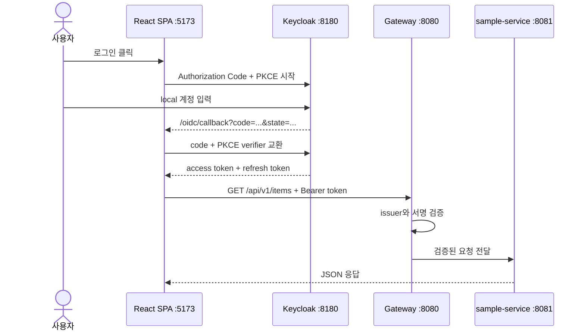

# 선택형 OIDC 인증을 처음부터 실행하기

이 문서는 인증을 처음 다루는 사람도 local Keycloak 로그인부터 Gateway의 JWT 검증까지 직접 확인하도록 설명한다. 기본 `apps/web/public/app-config.json`은 `auth.enabled=false`이므로 기존 비인증 local 실행은 그대로 동작한다. 아래 절차를 수행했을 때만 인증이 켜진다.

## 1. 먼저 이해할 네 가지

| 용어 | 이 저장소에서 하는 일 |
|---|---|
| Keycloak | 사용자의 아이디·비밀번호를 확인하고 access token을 발급한다. local 전용 OIDC provider다. |
| React SPA | 로그인 페이지로 이동시키고, 돌아온 authorization code를 PKCE로 교환한다. 비밀번호나 client secret을 받지 않는다. |
| access token | 로그인 성공 뒤 API 요청의 `Authorization: Bearer ...` 헤더에 넣는 짧은 수명의 증명서다. |
| Gateway | token 서명과 issuer를 검증한다. 유효한 token이 없으면 보호된 `/api` 요청을 거부한다. |



PKCE는 브라우저에 client secret을 저장하지 않고 authorization code 탈취 위험을 줄이는 방식이다. `template-spa`는 공개 client이며 S256 PKCE만 사용한다. local 부하 시험의 `local-test-client`는 별도의 기밀 client이므로 SPA에 사용하지 않는다.

## 2. 인증을 끈 기본 실행

기본 설정은 다음과 같다.

```json
{
  "environment": "local",
  "apiBaseUrl": "",
  "auth": {
    "enabled": false
  }
}
```

이 상태에서는 OIDC 라이브러리를 동적으로 불러오지 않고 API client도 `Authorization` 헤더를 만들지 않는다. Gateway 기본 `GATEWAY_SECURITY_ENABLED=false`와 함께 기존 local 연결 점검에 사용한다.

## 3. local OIDC를 켜는 전체 절차

명령은 각각 별도 PowerShell 터미널에서 실행한다. `JAVA_HOME`이 Java 11을 가리키면 Spring Boot가 시작되지 않으므로 Java 21을 명시한다.

### 3-1. 터미널 A — PostgreSQL과 Keycloak 시작

```powershell
cd D:\MyProjectTemplate
docker compose --env-file infra/.env.versions -f infra/compose.yml `
  --profile identity up -d --wait postgres keycloak
```

정상 여부를 확인한다.

```powershell
Invoke-RestMethod http://localhost:8180/realms/template/.well-known/openid-configuration | `
  Select-Object issuer, authorization_endpoint, token_endpoint
```

`issuer`가 `http://localhost:8180/realms/template`이면 정상이다.

### 3-2. Keycloak에 SPA client가 있는지 확인

새 local DB에서 시작했다면 `infra/keycloak/realm-template.json`이 다음 항목을 자동 생성한다.

- realm: `template`
- 공개 client: `template-spa`
- 로그인 사용자: `local-user`
- local 비밀번호: `local-user-password`
- login callback: `http://localhost:5173/oidc/callback`
- logout callback: `http://localhost:5173/oidc/logout-callback`

이전에 `template` realm을 만든 적이 있으면 Keycloak은 기존 realm을 보존하며 import 파일로 덮어쓰지 않는다. 이 경우 브라우저에서 <http://localhost:8180/admin>을 열고 local 관리자 `admin` / `admin-local-password`로 로그인한 뒤 다음을 확인한다.

1. 왼쪽 위 realm 선택에서 `template`을 고른다.
2. `Clients`에서 `template-spa`를 찾는다.
3. 없다면 `Create client`를 누르고 Client ID를 `template-spa`로 만든다.
4. `Client authentication`은 Off, `Standard flow`는 On으로 둔다.
5. `Valid redirect URIs`에 `http://localhost:5173/oidc/callback`, `http://localhost:5173/oidc/logout-callback`과 `http://localhost:5173/`을 각각 넣는다.
6. `Web origins`에 `http://localhost:5173`을 넣는다.
7. PKCE method를 `S256`으로 설정한다.
8. `Users`에 `local-user`가 없다면 사용자를 만든 뒤 Credentials에서 임시가 아닌 local 비밀번호를 정한다.

기존 DB 데이터를 지우고 싶지 않다면 `docker compose down -v`를 사용하지 않는다. `-v`는 Keycloak만이 아니라 이 Compose 프로젝트의 DB volume까지 제거할 수 있다.

### 3-3. 터미널 B — sample-service 시작

Gateway가 token을 검증하므로 첫 local 확인에서는 sample-service의 기존 local permit-all을 유지한다.

```powershell
cd D:\MyProjectTemplate
$env:JAVA_HOME='C:\Program Files\Java\jdk-21'
$env:PATH="$env:JAVA_HOME\bin;$env:PATH"
./gradlew :services:sample-service:bootRun --args='--spring.profiles.active=local'
```

다른 터미널에서 health가 `UP`인지 확인한다.

```powershell
Invoke-RestMethod http://localhost:8081/actuator/health
```

### 3-4. 터미널 C — Gateway 인증 켜기

기본 profile을 유지하면서 보안 스위치와 issuer만 환경변수로 켠다.

```powershell
cd D:\MyProjectTemplate
$env:JAVA_HOME='C:\Program Files\Java\jdk-21'
$env:PATH="$env:JAVA_HOME\bin;$env:PATH"
$env:GATEWAY_SECURITY_ENABLED='true'
$env:SPRING_SECURITY_OAUTH2_RESOURCESERVER_JWT_ISSUER_URI='http://localhost:8180/realms/template'
./gradlew :services:gateway-service:bootRun
```

로그인하지 않은 API가 거부되는지 확인한다. PowerShell은 401을 오류로 표시하는 것이 정상이다.

```powershell
try {
  Invoke-WebRequest http://localhost:8080/api/v1/items
} catch {
  $_.Exception.Response.StatusCode.value__
}
```

출력이 `401`이면 Gateway 보호가 켜졌다.

### 3-5. 프론트 런타임 설정 켜기

원본 기본 설정을 되돌릴 수 있도록 먼저 확인한 뒤 local OIDC 예제를 복사한다.

```powershell
cd D:\MyProjectTemplate
Get-Content apps/web/public/app-config.json
Copy-Item apps/web/public/app-config.oidc-local.example.json apps/web/public/app-config.json
```

복사 뒤 핵심 값은 다음과 같다.

```json
"auth": {
  "enabled": true,
  "authority": "http://localhost:8180/realms/template",
  "clientId": "template-spa",
  "scope": "openid profile email"
}
```

### 3-6. 터미널 D — React SPA 시작

```powershell
cd D:\MyProjectTemplate
pnpm install --frozen-lockfile
pnpm web:dev
```

반드시 <http://localhost:5173>으로 연다. `127.0.0.1`은 Keycloak에 등록한 exact redirect URI와 다르다.

### 3-7. 브라우저에서 로그인 확인

1. 상단에 `OIDC · 로그인 전 · 로그인`이 보이는지 확인한다.
2. 로그인 전에는 요청 경로가 `로그인 필요`이고 API 목록 호출이 시작되지 않는다.
3. `로그인`을 누른다.
4. Keycloak 화면에서 `local-user` / `local-user-password`를 입력한다.
5. 다시 서비스 콘솔로 돌아오면 상단에 `local-user`와 `로그아웃`이 보인다.
6. 그때 목록 조회가 시작되고 항목 생성 버튼이 활성화된다.
7. 브라우저 개발자 도구 Network에서 `/api/v1/items` 요청을 선택하면 Request Headers에 `Authorization: Bearer ...`가 있다. token 전체 값을 복사하거나 문서에 붙이지 않는다.

인증 확인을 마치고 기본 비인증 local 설정으로 되돌릴 때는 다음 예제를 복사한다.

```powershell
Copy-Item apps/web/public/app-config.local.example.json apps/web/public/app-config.json
```

## 4. token 갱신과 로그아웃이 동작하는 방식

- OIDC 관련 code와 token은 `sessionStorage`에 저장한다. 브라우저 탭 세션보다 오래 남는 `localStorage`는 사용하지 않는다.
- `oidc-client-ts`가 만료 전에 자동 갱신을 시도한다.
- API 호출 직전에 token이 이미 만료된 경우 한 번 silent renew를 수행한다.
- 갱신 세션도 끝났다면 token을 제거하고 `인증 확인 필요` 상태로 전환한다. 사용자가 `다시 로그인`을 눌러야 한다.
- `로그아웃`은 Keycloak의 end-session endpoint로 이동한다. `/oidc/logout-callback`에서 sign-out state를 완료하고 브라우저 user 정보를 비운 뒤 `postLogoutPath`로 돌아온다.
- 앱은 401 응답을 무한 재시도하지 않는다. 반복 재시도는 장애를 키우고 POST 중복 가능성을 만들기 때문이다.

## 5. `app-config.json` 인증 필드

| 필드 | 필수 조건 | 예 | 의미 |
|---|---|---|---|
| `auth.enabled` | 항상 | `false` | false면 OIDC 모듈과 로그인 UI를 사용하지 않는다. |
| `auth.authority` | enabled=true | `https://id.example.com/realms/app` | discovery 기준이 되는 issuer URL이다. |
| `auth.clientId` | enabled=true | `template-spa` | IdP에 등록한 공개 SPA client ID다. |
| `auth.scope` | 선택 | `openid profile email` | 반드시 `openid`를 포함한다. |
| `auth.callbackPath` | 선택 | `/oidc/callback` | 로그인 뒤 code를 처리하는 같은 origin 경로다. |
| `auth.logoutCallbackPath` | 선택 | `/oidc/logout-callback` | IdP 로그아웃 응답과 state를 완료하는 같은 origin 경로다. |
| `auth.postLogoutPath` | 선택 | `/` | login/logout callback을 정리한 뒤 표시할 앱 경로다. |

parser는 prod에서 localhost authority와 평문 HTTP를 거부한다. URL 안의 자격증명, query, fragment, 외부 callback URL도 거부한다. `clientSecret` 또는 `client_secret`이 발견되면 인증을 꺼 둔 설정이라도 시작을 중단한다.

## 6. dev/prod에 적용할 때

local 값을 그대로 복사하지 말고 환경마다 별도 OIDC realm/client를 만든다.

1. `authority`와 Gateway `issuer-uri`가 동일한 issuer를 가리키게 한다.
2. HTTPS를 사용한다.
3. redirect URI와 web origin을 실제 프론트 주소 하나씩 exact match로 등록한다. 넓은 `*` wildcard를 피한다.
4. SPA client는 공개 client로 만들고 client secret을 발급·주입하지 않는다.
5. Gateway와 각 서비스의 resource server를 필요에 따라 함께 켠다. Gateway만 검증하면 내부망 우회 호출을 별도 네트워크 정책으로 막아야 한다.
6. 프론트와 Gateway가 다른 origin이면 Gateway에 허용 origin·method·header를 명시한 CORS 정책이 추가로 필요하다. 같은 origin ingress를 우선한다.
7. CSP, dependency 점검과 XSS 방어를 운영 배포 조건에 포함한다. sessionStorage도 실행 중인 악성 JavaScript로부터 token을 완전히 보호하지 못한다.
8. 브라우저에서 token을 다루지 않아야 하는 고위험 서비스라면 HTTP-only 쿠키를 사용하는 BFF adapter를 별도 설계한다. 현재 코드는 BFF나 CSRF 방어를 구현했다고 간주하지 않는다.

## 7. 자주 생기는 문제

| 증상 | 원인 확인 | 해결 |
|---|---|---|
| Keycloak에 접속 안 됨 | `docker compose ... ps keycloak` | identity profile로 Keycloak과 PostgreSQL 시작 |
| 로그인 뒤 `Invalid parameter: redirect_uri` | 브라우저 주소와 client redirect 불일치 | `localhost:5173/oidc/callback` exact 등록, 127.0.0.1 사용 중지 |
| 설정 오류 화면에 https 메시지 | prod authority가 HTTP | 운영 OIDC provider HTTPS 주소 사용 |
| 로그인했지만 API 401 | Gateway issuer와 token issuer 불일치 | 두 값을 같은 realm URL로 맞춤 |
| `인증 확인 필요` | callback 오류 또는 refresh session 만료 | 화면의 다시 로그인 사용, Keycloak 로그 확인 |
| 기존 realm에 `template-spa` 없음 | Keycloak import가 기존 realm을 보존 | 3-2의 Admin Console 절차로 client 추가 |
| 로그인은 되지만 이름이 이상함 | profile scope/claim 차이 | `preferred_username`, `name`, `email`, `sub` 순으로 표시됨을 확인 |

## 8. 자동 검증

```powershell
cd D:\MyProjectTemplate
pnpm frontend:check
```

이 검증은 비활성 상태에서 OIDC module을 만들지 않는지, callback 처리, expired token 갱신, Bearer header, 미로그인 API 차단, runtime secret 거부와 production build의 분리 chunk를 확인한다. 실제 IdP redirect는 브라우저·Keycloak·Gateway가 모두 필요한 통합 검증이므로 배포 환경별 smoke를 추가로 수행한다.
